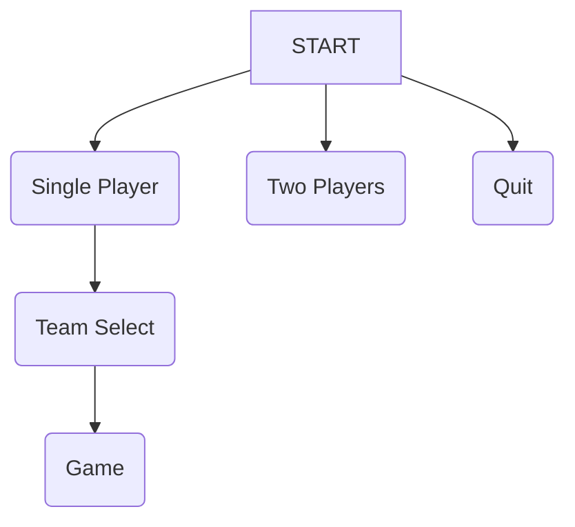

bash
```
uv run main.py
```
https://youtu.be/6gLeplbqtqg?si=m0WoZor5rseNvGT1


```mermaid
graph TD
    S[START] --> SP(Single Player)
    S --> TP(Two Players)
    S --> Q(Quit)

    SP --> TS(Team Select)
    
    TS --> G(Game)


```

```mermaid
put heros on map -->  
```